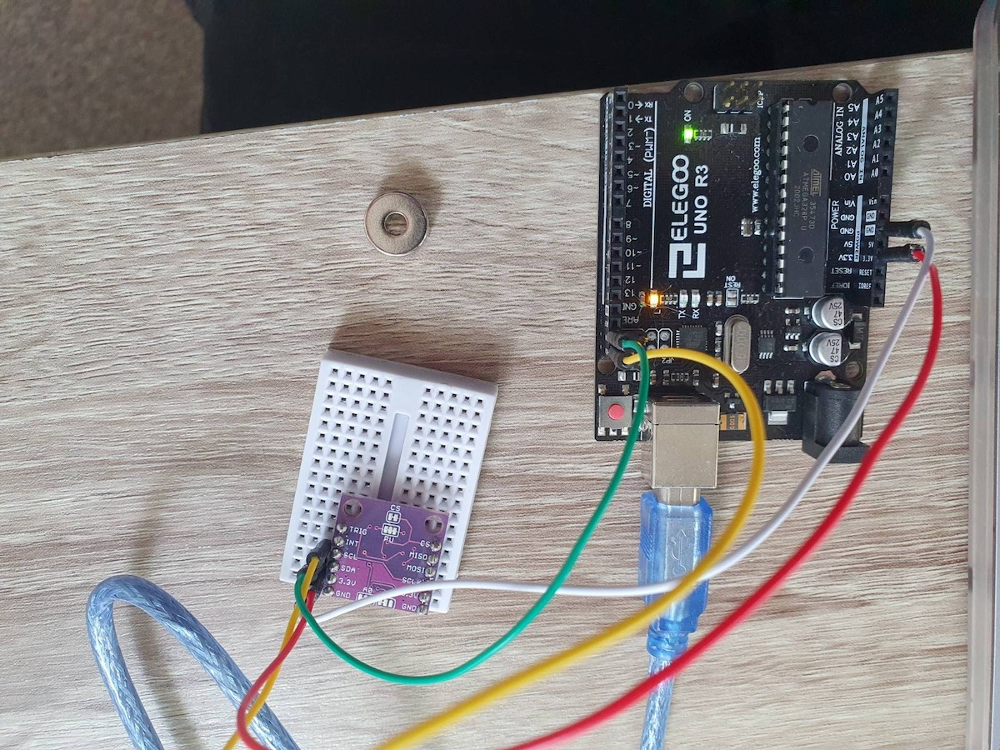
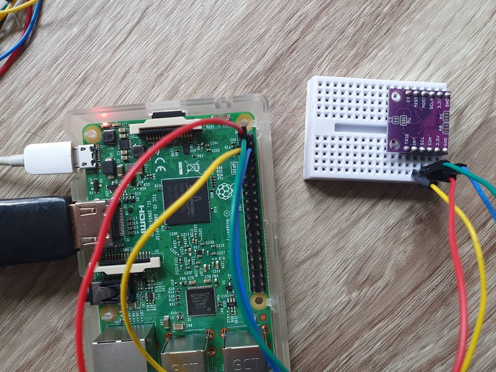
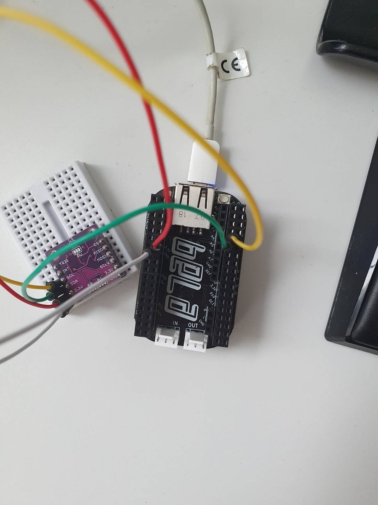

This document is trying to summarise steps performed to create working implementation.

# Facts

- **Used sensor:** MLX90393
- **Address of sensor:** 0x0c

# Pre-checks

## Goal: Sensor is working with the official library

<details>
<summary>Description</summary>

We wanted to test if our sensor is not broken and it is returning data as expected.
For tests, we used [MLX90393](https://www.adafruit.com/product/4022) with the official libraries:
- [Adafruit MLX90393](https://github.com/adafruit/Adafruit_MLX90393_Library) version `2.0.4`
  - [Adafruit BusIO](https://github.com/adafruit/Adafruit_BusIO) version `1.14.2`
  - [Adafruit Unified Sensor](https://github.com/adafruit/Adafruit_Sensor) version `1.1.10`
  - Lib [Adafruit SSD1306](https://github.com/adafruit/Adafruit_SSD1306) was download by Arduino IDE as well but is was not used during testing (lib is necessary only if you use display for testing; we used only serial port for debug messages)

Provided example [basicdemo.ino](https://github.com/adafruit/Adafruit_MLX90393_Library/blob/master/examples/basicdemo/basicdemo.ino) was used for testing.

</details>

<details>
<summary>Setup</summary>



</details>

<details>
<summary>Example output</summary>

```
Starting Adafruit MLX90393 Demo
Found a MLX90393 sensor
Gain set to: 2.5 x
X: -9.0120 uT
Y: -12.0160 uT
Z: 37.5100 uT
X: -9.01 	Y: -12.02 	Z: 37.51 uTesla 
```

</details>

**Result:** Sensor works

## Goal: Sensor communicate with Linux-based system over I2C

<details>
<summary>Setup</summary>

For test we choose RaspPI



</details>

<details>
<summary>List buses</summary>

```shell
$ i2cdetect -l
i2c-1	i2c       	bcm2835 (i2c@7e804000)          	I2C adapter
i2c-2	i2c       	bcm2835 (i2c@7e805000)          	I2C adapter
```

</details>

<details>
<summary>Test i2c capabilities</summary>

```shell
$ i2cdetect -F 1
Functionalities implemented by /dev/i2c-1:
I2C                              yes
SMBus Quick Command              yes
SMBus Send Byte                  yes
SMBus Receive Byte               yes
SMBus Write Byte                 yes
SMBus Read Byte                  yes
SMBus Write Word                 yes
SMBus Read Word                  yes
SMBus Process Call               yes
SMBus Block Write                yes
SMBus Block Read                 no
SMBus Block Process Call         no
SMBus PEC                        yesd
I2C Block Write                  yes
I2C Block Read                   yes
```

_Note:_ RaspPI supports "SMBus Quick Command" on the used bus. But it is not supported on Bela. It might be the reason of non-working communication.

</details>

<details>
<summary>Test regular detection - works ✅</summary>

```shell
$ i2cdetect -y 1
     0  1  2  3  4  5  6  7  8  9  a  b  c  d  e  f
00:                         -- -- -- -- 0c -- -- -- 
10: -- -- -- -- -- -- -- -- -- -- -- -- -- -- -- -- 
20: -- -- -- -- -- -- -- -- -- -- -- -- -- -- -- -- 
30: -- -- -- -- -- -- -- -- -- -- -- -- -- -- -- -- 
40: -- -- -- -- -- -- -- -- -- -- -- -- -- -- -- -- 
50: -- -- -- -- -- -- -- -- -- -- -- -- -- -- -- -- 
60: -- -- -- -- -- -- -- -- -- -- -- -- -- -- -- -- 
70: -- -- -- -- -- -- -- --                         
```

</details>

<details>
<summary>Test "quick write" detection - works ✅</summary>

```shell
$ i2cdetect -y -q 1
     0  1  2  3  4  5  6  7  8  9  a  b  c  d  e  f
00:                         -- -- -- -- 0c -- -- -- 
10: -- -- -- -- -- -- -- -- -- -- -- -- -- -- -- -- 
20: -- -- -- -- -- -- -- -- -- -- -- -- -- -- -- -- 
30: -- -- -- -- -- -- -- -- -- -- -- -- -- -- -- -- 
40: -- -- -- -- -- -- -- -- -- -- -- -- -- -- -- -- 
50: -- -- -- -- -- -- -- -- -- -- -- -- -- -- -- -- 
60: -- -- -- -- -- -- -- -- -- -- -- -- -- -- -- -- 
70: -- -- -- -- -- -- -- --                                               
```

</details>

<details>
<summary>Test "receive byte" detection - does not work (sensor not detected) ❌</summary>

```shell
$ i2cdetect -y -r 1
     0  1  2  3  4  5  6  7  8  9  a  b  c  d  e  f
00:                         -- -- -- -- -- -- -- -- 
10: -- -- -- -- -- -- -- -- -- -- -- -- -- -- -- -- 
20: -- -- -- -- -- -- -- -- -- -- -- -- -- -- -- -- 
30: -- -- -- -- -- -- -- -- -- -- -- -- -- -- -- -- 
40: -- -- -- -- -- -- -- -- -- -- -- -- -- -- -- -- 
50: -- -- -- -- -- -- -- -- -- -- -- -- -- -- -- -- 
60: -- -- -- -- -- -- -- -- -- -- -- -- -- -- -- -- 
70: -- -- -- -- -- -- -- --                                                                
```

</details>


<details>
<summary>Test basic functionality (i2ctransfer) - works ✅</summary>

These lines are trying to run [first 2 commands performed by official library](https://github.com/adafruit/Adafruit_MLX90393_Library/blob/2ac6883873a69d45c45d4371c26a4fc7a81d7777/Adafruit_MLX90393.cpp#L72-L78).

- Controler: `0x80` => `MLX90393_REG_EX` (enter ExitMode)
- Sensor: `0x01` => `0x01 >> 2 == MLX90393_STATUS_OK`
- Controler: `0xF0` => `MLX90393_REG_RT` (soft reset)
- Sensor: `0x05` => `0x05 >> 2 == MLX90393_STATUS_RESET` (just restarted)

```shell
$ i2ctransfer -v -y 1 w1@0x0c 0x80 r1@0x0c
msg 0: addr 0x0c, write, len 1, buf 0x80
msg 1: addr 0x0c, read, len 1, buf 0x01
$ i2ctransfer -v -y 1 w1@0x0c 0xF0 r1@0x0c
msg 0: addr 0x0c, write, len 1, buf 0xf0
msg 1: addr 0x0c, read, len 1, buf 0x05
```

</details>

<details>
<summary>Test basic functionality (i2cget, i2cset) - works ✅</summary>

Bela platform does not have `i2ctransfer` so we are going to simulate same scenario with `i2cget` and  `i2cset`

- Controler: `0x80` => `MLX90393_REG_EX` (enter ExitMode)
- Sensor: `0x02` => `0x02 >> 2 == MLX90393_STATUS_OK`
- Controler: `0xF0` => `MLX90393_REG_RT` (soft reset)
- Sensor: `0x06` => `0x06 >> 2 == MLX90393_STATUS_RESET` (just restarted)

```shell
$ i2cset -y 1 0x0c 0x80
$ i2cget -y 1 0x0c
0x02
$ i2cset -y 1 0x0c 0xF0
$ i2cget -y 1 0x0c
0x06
```

</details>

**Result:** Communication with sensor is possible

## Goal: Sensor communicate with Bela system over I2C

<details>
<summary>Setup</summary>



</details>


<details>
<summary>List buses</summary>

```shell
# i2cdetect -l
i2c-1	i2c       	OMAP I2C adapter                	I2C adapter
i2c-2	i2c       	OMAP I2C adapter                	I2C adapter
i2c-0	i2c       	OMAP I2C adapter                	I2C adapter
```

</details>

<details>
<summary>Test i2c capabilities</summary>

```shell
# i2cdetect -F 1
Functionalities implemented by /dev/i2c-1:
I2C                              yes
SMBus Quick Command              no
SMBus Send Byte                  yes
SMBus Receive Byte               yes
SMBus Write Byte                 yes
SMBus Read Byte                  yes
SMBus Write Word                 yes
SMBus Read Word                  yes
SMBus Process Call               yes
SMBus Block Write                yes
SMBus Block Read                 no
SMBus Block Process Call         no
SMBus PEC                        yes
I2C Block Write                  yes
I2C Block Read                   yes
```

</details>

<details>
<summary>Test regular detection - does not work ("Quick Write" not supposed) ❌</summary>

```shell
# i2cdetect -y 1
Error: Can't use SMBus Quick Write command on this bus                      
```

</details>

<details>
<summary>Test "quick write" detection - does not work ("Quick Write" not supposed) ❌</summary>

```shell
# i2cdetect -y -q 1
Error: Can't use SMBus Quick Write command on this bus
```

</details>

<details>
<summary>Test "receive byte" detection - does not work (sensor not detected) ❌</summary>

```shell
# i2cdetect -y -r 1
     0  1  2  3  4  5  6  7  8  9  a  b  c  d  e  f
00:          -- -- -- -- -- -- -- -- -- -- -- -- --
10: -- -- -- -- -- -- -- -- -- -- -- -- -- -- -- --
20: -- -- -- -- -- -- -- -- -- -- -- -- -- -- -- --
30: -- -- -- -- -- -- -- -- -- -- -- -- -- -- -- --
40: -- -- -- -- -- -- -- -- -- -- -- -- -- -- -- --
50: -- -- -- -- -- -- -- -- -- -- -- -- -- -- -- --
60: -- -- -- -- -- -- -- -- -- -- -- -- -- -- -- --
70: -- -- -- -- -- -- -- --                                                              
```

</details>


<details>
<summary>Test basic functionality (i2ctransfer) - does not work (command not found) ❌</summary>

```shell
# i2ctransfer
-bash: i2ctransfer: command not found
```

</details>

<details>
<summary>Test basic functionality (i2cget, i2cset) - works ✅</summary>

Bela platform does not have `i2ctransfer` so we are going to simulate same scenario with `i2cget` and `i2cset`

- Controler: `0x80` => `MLX90393_REG_EX` (enter ExitMode)
- Sensor: `0x02` => `0x02 >> 2 == MLX90393_STATUS_OK`
- Controler: `0xF0` => `MLX90393_REG_RT` (soft reset)
- Sensor: `0x06` => `0x06 >> 2 == MLX90393_STATUS_RESET` (just restarted)

```shell
# i2cset -y 1 0x0c 0x80
# i2cget -y 1 0x0c
0x02
# i2cset -y 1 0x0c 0xF0
# i2cget -y 1 0x0c
0x06
```

</details>


<details>
<summary>Basic test with official Bela `I2c.h` - works ✅</summary>

Same sequence, same result

```cpp
#include <Bela.h>
#include <I2c.h>

bool setup(BelaContext *context, void *userData)
{
	I2c i2cBus;
	uint8_t txBuffer[1], rxBuffer[1];
	ssize_t w, r;

	i2cBus.initI2C_RW(1, 0x0c, 0);
	
	txBuffer[0] = 0x80;
	w = i2cBus.writeBytes(txBuffer, 1);
	r = i2cBus.readBytes(rxBuffer, 1);
	rt_printf("WriteStatus: 0x%x, ReadStatus: 0x%x, Data: 0x%x\n", w, r, rxBuffer[0]);
	
	txBuffer[0] = 0xF0;
	w = i2cBus.writeBytes(txBuffer, 1);
	r = i2cBus.readBytes(rxBuffer, 1);
	rt_printf("WriteStatus: 0x%x, ReadStatus: 0x%x, Data: 0x%x\n", w, r, rxBuffer[0]);

	i2cBus.closeI2C();
	
	return true;
}

void render(BelaContext *context, void *userData)
{

}

void cleanup(BelaContext *context, void *userData)
{

}
```

Output:

```
WriteStatus: 0x1, ReadStatus: 0x1, Data: 0x2
WriteStatus: 0x1, ReadStatus: 0x1, Data: 0x6
```

</details>

# "Real" tests

<details>
<summary>wiringBone - "default" - auto_detect does not work ❌</summary>

`Adafruit_I2CDevice.cpp` supports `auto_detect` (default: `true`) but it doesn't work in this setup. Even if you disconnect sensor, debug log still says `Detected`.

</details>

<details>
<summary>wiringBone - "default" - does not work (force writing unnecessary Comm) ❌</summary>

Fail during the reading because implementation uses `i2c_smbus_read_i2c_block_data` which (based on [documentation](https://www.kernel.org/doc/html/latest/i2c/smbus-protocol.html#i2c-block-read)) is sending `S Addr Wr [A] Comm [A]` before it would start reading. This setup is not acceptable by all devices.

</details>

<details>
<summary>wiringBone - replace `i2c_smbus_read_i2c_block_data` with `i2c_smbus_read_byte` - does not work ❌ </summary>

So we replaces `i2c_smbus_read_i2c_block_data` with `i2c_smbus_read_byte`: https://github.com/kiblik/wiringBone/commit/f6db6681e4dc8ff50e59bb164bd293516bd3031a

Now this implementation miss error handling during reading.

But there is at least some progress:

```
# ./i2c_test
Getting ready
Detected
	I2CWRITE @ 0xc :: 0x80, 	STOP
	I2CREAD  @ 0xc :: 0x1,
	I2CWRITE @ 0xc :: 0xf0, 	STOP
	I2CREAD  @ 0xc :: 0x5,
	I2CWRITE @ 0xc :: 0x50, 0x0, 	STOP
	I2CREAD  @ 0xc :: 0x0, 0xff, 0xff,
	I2CWRITE @ 0xc :: 0x60, 0xff, 0xff, 0x0, 	STOP
	I2CREAD  @ 0xc :: 0x1,
	I2CWRITE @ 0xc :: 0x50, 0x8, 	STOP
	I2CREAD  @ 0xc :: 0x0, 0xff, 0xff,
	I2CWRITE @ 0xc :: 0x60, 0xff, 0x9f, 0x8, 	STOP
	I2CREAD  @ 0xc :: 0x1,
	I2CWRITE @ 0xc :: 0x50, 0x8, 	STOP
	I2CREAD  @ 0xc :: 0x0, 0xff, 0xff,
	I2CWRITE @ 0xc :: 0x60, 0xfe, 0x7f, 0x8, 	STOP
	I2CREAD  @ 0xc :: 0x1,
	I2CWRITE @ 0xc :: 0x50, 0x8, 	STOP
	I2CREAD  @ 0xc :: 0x0, 0xff, 0xff,
	I2CWRITE @ 0xc :: 0x60, 0xf9, 0xff, 0x8, 	STOP
	I2CREAD  @ 0xc :: 0x1,
	I2CWRITE @ 0xc :: 0x50, 0x8, 	STOP
	I2CREAD  @ 0xc :: 0x0, 0xff, 0xff,
	I2CWRITE @ 0xc :: 0x60, 0xff, 0xff, 0x8, 	STOP
	I2CREAD  @ 0xc :: 0x1,
	I2CWRITE @ 0xc :: 0x50, 0x8, 	STOP
	I2CREAD  @ 0xc :: 0x0, 0xff, 0xff,
	I2CWRITE @ 0xc :: 0x60, 0xff, 0xff, 0x8, 	STOP
	I2CREAD  @ 0xc :: 0x1,
	I2CWRITE @ 0xc :: 0x50, 0x4, 	STOP
	I2CREAD  @ 0xc :: 0x0, 0xff, 0xff,
	I2CWRITE @ 0xc :: 0x60, 0x7f, 0xff, 0x4, 	STOP
	I2CREAD  @ 0xc :: 0x1,
Found a MLX90393 sensor
	I2CWRITE @ 0xc :: 0x50, 0x0, 	STOP
	I2CREAD  @ 0xc :: 0x0, 0xff, 0xff,
	I2CWRITE @ 0xc :: 0x60, 0xff, 0xbf, 0x0, 	STOP
	I2CREAD  @ 0xc :: 0x1,
Gain set to: 	I2CWRITE @ 0xc :: 0x50, 0x0, 	STOP
	I2CREAD  @ 0xc :: 0x0, 0xff, 0xff,
1 x
	I2CWRITE @ 0xc :: 0x50, 0x8, 	STOP
	I2CREAD  @ 0xc :: 0x0, 0xff, 0xff,
	I2CWRITE @ 0xc :: 0x60, 0xff, 0xff, 0x8, 	STOP
	I2CREAD  @ 0xc :: 0x1,
	I2CWRITE @ 0xc :: 0x50, 0x8, 	STOP
	I2CREAD  @ 0xc :: 0x0, 0xff, 0xff,
	I2CWRITE @ 0xc :: 0x60, 0xff, 0xff, 0x8, 	STOP
	I2CREAD  @ 0xc :: 0x1,
	I2CWRITE @ 0xc :: 0x50, 0x8, 	STOP
	I2CREAD  @ 0xc :: 0x0, 0xff, 0xff,
	I2CWRITE @ 0xc :: 0x60, 0xf9, 0xff, 0x8, 	STOP
	I2CREAD  @ 0xc :: 0x1,
	I2CWRITE @ 0xc :: 0x50, 0x8, 	STOP
	I2CREAD  @ 0xc :: 0x0, 0xff, 0xff,
	I2CWRITE @ 0xc :: 0x60, 0xff, 0xfe, 0x8, 	STOP
	I2CREAD  @ 0xc :: 0x1,
	I2CWRITE @ 0xc :: 0x50, 0x8, 	STOP
	I2CREAD  @ 0xc :: 0x0, 0xff, 0xff,
	I2CWRITE @ 0xc :: 0x60, 0xff, 0xfb, 0x8, 	STOP
	I2CREAD  @ 0xc :: 0x1,
	I2CWRITE @ 0xc :: 0x3e, 	STOP
	I2CREAD  @ 0xc :: 0x21,
	I2CWRITE @ 0xc :: 0x4e, 	STOP
	I2CREAD  @ 0xc :: 0x31, 0xff, 0xff, 0xff, 0xff, 0xff, 0xff,
Unable to read XYZ data from the sensor.	I2CWRITE @ 0xc :: 0x3e, 	STOP
	I2CREAD  @ 0xc :: 0x31,
X: 16384 	Y: 16384 	Z: 16384 uTesla
	I2CWRITE @ 0xc :: 0x3e, 	STOP
	I2CREAD  @ 0xc :: 0x31,
Unable to read XYZ data from the sensor.	I2CWRITE @ 0xc :: 0x3e, 	STOP
	I2CREAD  @ 0xc :: 0x31,
X: 16384 	Y: 16384 	Z: 16384 uTesla
Underrun detected: 2 blocks dropped
	I2CWRITE @ 0xc :: 0x3e, 	STOP
	I2CREAD  @ 0xc :: 0x31,
Unable to read XYZ data from the sensor.	I2CWRITE @ 0xc :: 0x3e, 	STOP
	I2CREAD  @ 0xc :: 0x31,
X: 16384 	Y: 16384 	Z: 16384 uTesla
Underrun detected: 3 blocks dropped
	I2CWRITE @ 0xc :: 0x3e, 	STOP
	I2CREAD  @ 0xc :: 0x31,
```

Unfortunately, it complains "Unable to read XYZ data from the sensor."

</details>

<details>
<summary>wiringBone - add error handling - does not work ❌ </summary>

We added error handling https://github.com/kiblik/wiringBone/commit/86e256e3ef00c1e63e13d4b937523b755f77c6f1

Now, we can see that there was issue even earlier but we did not detect it.

```
# ./i2c_test
Failed to read byte: Remote I/O error
Failed to read byte: Remote I/O error
Failed to read byte: Remote I/O error
Failed to read byte: Remote I/O error
Failed to read byte: Remote I/O error
Failed to read byte: Remote I/O error
Failed to read byte: Remote I/O error
Failed to read byte: Remote I/O error
Failed to read byte: Remote I/O error
Failed to read byte: Remote I/O error
Failed to read byte: Remote I/O error
Failed to read byte: Remote I/O error
Failed to read byte: Remote I/O error
Failed to read byte: Remote I/O error
Getting ready
Detected
	I2CWRITE @ 0xc :: 0x80, 	STOP
	I2CREAD  @ 0xc :: 0x1,
	I2CWRITE @ 0xc :: 0xf0, 	STOP
	I2CREAD  @ 0xc :: 0x5,
	I2CWRITE @ 0xc :: 0x50, 0x0, 	STOP
	I2CDevice did not receive enough data: 255
	I2CWRITE @ 0xc :: 0x60, 0x0, 0x70, 0x0, 	STOP
	I2CREAD  @ 0xc :: 0x1,
	I2CWRITE @ 0xc :: 0x50, 0x8, 	STOP
	I2CDevice did not receive enough data: 255
	I2CWRITE @ 0xc :: 0x60, 0x0, 0x0, 0x8, 	STOP
	I2CREAD  @ 0xc :: 0x1,
	I2CWRITE @ 0xc :: 0x50, 0x8, 	STOP
	I2CDevice did not receive enough data: 255
	I2CWRITE @ 0xc :: 0x60, 0x0, 0x0, 0x8, 	STOP
	I2CREAD  @ 0xc :: 0x1,
	I2CWRITE @ 0xc :: 0x50, 0x8, 	STOP
	I2CDevice did not receive enough data: 255
	I2CWRITE @ 0xc :: 0x60, 0x0, 0x0, 0x8, 	STOP
	I2CREAD  @ 0xc :: 0x1,
	I2CWRITE @ 0xc :: 0x50, 0x8, 	STOP
	I2CDevice did not receive enough data: 255
	I2CWRITE @ 0xc :: 0x60, 0x0, 0x3, 0x8, 	STOP
	I2CREAD  @ 0xc :: 0x1,
	I2CWRITE @ 0xc :: 0x50, 0x8, 	STOP
	I2CDevice did not receive enough data: 255
	I2CWRITE @ 0xc :: 0x60, 0x0, 0x1c, 0x8, 	STOP
	I2CREAD  @ 0xc :: 0x1,
	I2CWRITE @ 0xc :: 0x50, 0x4, 	STOP
	I2CDevice did not receive enough data: 255
	I2CWRITE @ 0xc :: 0x60, 0x0, 0x0, 0x4, 	STOP
	I2CREAD  @ 0xc :: 0x1,
Found a MLX90393 sensor
	I2CWRITE @ 0xc :: 0x50, 0x0, 	STOP
	I2CDevice did not receive enough data: 255
	I2CWRITE @ 0xc :: 0x60, 0x0, 0x30, 0x0, 	STOP
	I2CREAD  @ 0xc :: 0x1,
Gain set to: 	I2CWRITE @ 0xc :: 0x50, 0x0, 	STOP
	I2CDevice did not receive enough data: 255
5 x
	I2CWRITE @ 0xc :: 0x50, 0x8, 	STOP
	I2CDevice did not receive enough data: 255
	I2CWRITE @ 0xc :: 0x60, 0x0, 0x60, 0x8, 	STOP
	I2CREAD  @ 0xc :: 0x1,
	I2CWRITE @ 0xc :: 0x50, 0x8, 	STOP
	I2CDevice did not receive enough data: 255
	I2CWRITE @ 0xc :: 0x60, 0x1, 0x80, 0x8, 	STOP
	I2CREAD  @ 0xc :: 0x1,
	I2CWRITE @ 0xc :: 0x50, 0x8, 	STOP
	I2CDevice did not receive enough data: 255
	I2CWRITE @ 0xc :: 0x60, 0x0, 0x0, 0x8, 	STOP
	I2CREAD  @ 0xc :: 0x1,
	I2CWRITE @ 0xc :: 0x50, 0x8, 	STOP
	I2CDevice did not receive enough data: 255
	I2CWRITE @ 0xc :: 0x60, 0x0, 0x2, 0x8, 	STOP
	I2CREAD  @ 0xc :: 0x1,
	I2CWRITE @ 0xc :: 0x50, 0x8, 	STOP
	I2CDevice did not receive enough data: 255
	I2CWRITE @ 0xc :: 0x60, 0x0, 0x18, 0x8, 	STOP
	I2CREAD  @ 0xc :: 0x1,
	I2CWRITE @ 0xc :: 0x3e, 	STOP
Failed to read byte: Remote I/O error
	I2CREAD  @ 0xc :: 0x21,
	I2CWRITE @ 0xc :: 0x4e, 	STOP
	I2CDevice did not receive enough data: 255
Unable to read XYZ data from the sensor.	I2CWRITE @ 0xc :: 0x3e, 	STOP
Failed to read byte: Remote I/O error
```

</details>

<details>
<summary>wiringBone - No error code but number read bytes + More verbose debug - does not work ❌ </summary>

We replaces `-1` with number of read bytes https://github.com/kiblik/wiringBone/commit/d49b73549495d9467cedff7c7be478e2fde86f7c

And made debug message more verbose. Now we are receiveing:

```
Failed to read byte: Remote I/O error
Getting ready
Detected
	I2CWRITE @ 0xc :: 0x80, 	STOP
	I2CREAD  @ 0xc :: 0x2,
	I2CWRITE @ 0xc :: 0xf0, 	STOP
	I2CREAD  @ 0xc :: 0x6,
	I2CWRITE @ 0xc :: 0x50, 0x0, 	STOP
	I2CDevice did not receive enough data: 1 expted: 3
...
```

We can see that first 2 commands (which we tested by official method) are passing sucessfully. We would test also other commands.

</details>

<details>
<summary>Official approach - More commands - works ✅</summary>

We enabled `debug` for Arduino and checked, how official workflow should look like:

```
Starting Adafruit MLX90393 Demo
Detected
	I2CWRITE @ 0xC :: 0x80, 	STOP
	I2CREAD  @ 0xC :: 0x2, 
	I2CWRITE @ 0xC :: 0xF0, 	STOP
	I2CREAD  @ 0xC :: 0x6, 
	I2CWRITE @ 0xC :: 0x50, 0x0, 	STOP
	I2CREAD  @ 0xC :: 0x0, 0x0, 0x7C, 
	I2CWRITE @ 0xC :: 0x60, 0x0, 0x7C, 0x0, 	STOP
	I2CREAD  @ 0xC :: 0x2, 
	I2CWRITE @ 0xC :: 0x50, 0x8, 	STOP
	I2CREAD  @ 0xC :: 0x0, 0x0, 0x0, 
	I2CWRITE @ 0xC :: 0x60, 0x0, 0x0, 0x8, 	STOP
	I2CREAD  @ 0xC :: 0x2, 
	I2CWRITE @ 0xC :: 0x50, 0x8, 	STOP
	I2CREAD  @ 0xC :: 0x0, 0x0, 0x0, 
	I2CWRITE @ 0xC :: 0x60, 0x0, 0x0, 0x8, 	STOP
	I2CREAD  @ 0xC :: 0x2, 
	I2CWRITE @ 0xC :: 0x50, 0x8, 	STOP
	I2CREAD  @ 0xC :: 0x0, 0x0, 0x0, 
	I2CWRITE @ 0xC :: 0x60, 0x0, 0x0, 0x8, 	STOP
	I2CREAD  @ 0xC :: 0x2, 
	I2CWRITE @ 0xC :: 0x50, 0x8, 	STOP
	I2CREAD  @ 0xC :: 0x0, 0x0, 0x0, 
	I2CWRITE @ 0xC :: 0x60, 0x0, 0x3, 0x8, 	STOP
	I2CREAD  @ 0xC :: 0x2, 
	I2CWRITE @ 0xC :: 0x50, 0x8, 	STOP
	I2CREAD  @ 0xC :: 0x0, 0x0, 0x3, 
	I2CWRITE @ 0xC :: 0x60, 0x0, 0x1F, 0x8, 	STOP
	I2CREAD  @ 0xC :: 0x2, 
	I2CWRITE @ 0xC :: 0x50, 0x4, 	STOP
	I2CREAD  @ 0xC :: 0x0, 0x0, 0x0, 
	I2CWRITE @ 0xC :: 0x60, 0x0, 0x0, 0x4, 	STOP
	I2CREAD  @ 0xC :: 0x2, 
Found a MLX90393 sensor
	I2CWRITE @ 0xC :: 0x50, 0x0, 	STOP
	I2CREAD  @ 0xC :: 0x0, 0x0, 0x7C, 
	I2CWRITE @ 0xC :: 0x60, 0x0, 0x3C, 0x0, 	STOP
	I2CREAD  @ 0xC :: 0x2, 
Gain set to: 	I2CWRITE @ 0xC :: 0x50, 0x0, 	STOP
	I2CREAD  @ 0xC :: 0x0, 0x0, 0x3C, 
2.5 x
	I2CWRITE @ 0xC :: 0x50, 0x8, 	STOP
	I2CREAD  @ 0xC :: 0x0, 0x0, 0x1F, 
	I2CWRITE @ 0xC :: 0x60, 0x0, 0x7F, 0x8, 	STOP
	I2CREAD  @ 0xC :: 0x2, 
	I2CWRITE @ 0xC :: 0x50, 0x8, 	STOP
	I2CREAD  @ 0xC :: 0x0, 0x0, 0x7F, 
	I2CWRITE @ 0xC :: 0x60, 0x1, 0xFF, 0x8, 	STOP
	I2CREAD  @ 0xC :: 0x2, 
	I2CWRITE @ 0xC :: 0x50, 0x8, 	STOP
	I2CREAD  @ 0xC :: 0x0, 0x1, 0xFF, 
	I2CWRITE @ 0xC :: 0x60, 0x1, 0xFF, 0x8, 	STOP
	I2CREAD  @ 0xC :: 0x2, 
	I2CWRITE @ 0xC :: 0x50, 0x8, 	STOP
	I2CREAD  @ 0xC :: 0x0, 0x1, 0xFF, 
	I2CWRITE @ 0xC :: 0x60, 0x1, 0xFE, 0x8, 	STOP
	I2CREAD  @ 0xC :: 0x2, 
	I2CWRITE @ 0xC :: 0x50, 0x8, 	STOP
	I2CREAD  @ 0xC :: 0x0, 0x1, 0xFE, 
	I2CWRITE @ 0xC :: 0x60, 0x1, 0xFA, 0x8, 	STOP
	I2CREAD  @ 0xC :: 0x2, 
	I2CWRITE @ 0xC :: 0x3E, 	STOP
	I2CREAD  @ 0xC :: 0x22, 
	I2CWRITE @ 0xC :: 0x4E, 	STOP
	I2CREAD  @ 0xC :: 0x2, 0x3F, 0xFF, 0x3F, 0xF5, 0xFF, 0xDB, 
X: -3.0040 uT
Y: -33.0440 uT
Z: -22.3850 uT
	I2CWRITE @ 0xC :: 0x3E, 	STOP
	I2CREAD  @ 0xC :: 0x22, 
	I2CWRITE @ 0xC :: 0x4E, 	STOP
	I2CREAD  @ 0xC :: 0x2, 0x3F, 0xFF, 0x3F, 0xF6, 0xFF, 0xD8, 
X: -3.00 	Y: -30.04 	Z: -24.20 uTesla 
```

So we updated "simple test" code 

```cpp
bool setup(BelaContext *context, void *userData)
{
	I2c i2cBus;
	uint8_t txBuffer[2], rxBuffer[3];
	ssize_t w, r;

	i2cBus.initI2C_RW(1, 0x0c, 0);
	
	// exitMode()
	txBuffer[0] = 0x80;
	w = i2cBus.writeBytes(txBuffer, 1);
	r = i2cBus.readBytes(rxBuffer, 1);
	rt_printf("WriteStatus: 0x%x, ReadStatus: 0x%x, Data: 0x%x\n", w, r, rxBuffer[0]);
	
	// reset()
	txBuffer[0] = 0xF0;
	w = i2cBus.writeBytes(txBuffer, 1);
	r = i2cBus.readBytes(rxBuffer, 1);
	rt_printf("WriteStatus: 0x%x, ReadStatus: 0x%x, Data: 0x%x\n", w, r, rxBuffer[0]);

	// setGain(MLX90393_GAIN_1X)
	//   readRegister(MLX90393_CONF1, &data);
	txBuffer[0] = 0x50;
	txBuffer[1] = 0x00;
	w = i2cBus.writeBytes(txBuffer, 2);
	r = i2cBus.readBytes(rxBuffer, 3);
	rt_printf("WriteStatus: 0x%x, ReadStatus: 0x%x, Data: 0x%x 0x%x 0x%x\n", w, r, rxBuffer[0], rxBuffer[1], rxBuffer[2]);

	i2cBus.closeI2C();
	
	return true;
}
```

And it worked as expected:

```
WriteStatus: 0x1, ReadStatus: 0x1, Data: 0x2
WriteStatus: 0x1, ReadStatus: 0x1, Data: 0x6
WriteStatus: 0x2, ReadStatus: 0x3, Data: 0x0 0x0 0x7c
```

We decited to adopted official Bela lib to "wiringBone"

</details>


<details>
<summary>wiringBone - adoption of official approach - does not work ❌ </summary>

We adopted the official approach to wiringBone lib https://github.com/kiblik/wiringBone/commit/adc2a652afb49ffd54bdf87de5ac66207c73ca2b

Beginning of communication looked expected but process get stacked on the message "Found a MLX90393 sensor"

```
Getting ready
Detected
	I2CWRITE @ 0xc :: 0x80, 	STOP
	I2CREAD  @ 0xc :: 0x2, 
	I2CWRITE @ 0xc :: 0xf0, 	STOP
	I2CREAD  @ 0xc :: 0x6, 
	I2CWRITE @ 0xc :: 0x50, 0x0, 	STOP
	I2CREAD  @ 0xc :: 0x0, 0x0, 0x7c, 
	I2CWRITE @ 0xc :: 0x60, 0x0, 0x7c, 0x0, 	STOP
	I2CREAD  @ 0xc :: 0x2, 
	I2CWRITE @ 0xc :: 0x50, 0x8, 	STOP
	I2CREAD  @ 0xc :: 0x0, 0x0, 0x0, 
	I2CWRITE @ 0xc :: 0x60, 0x0, 0x0, 0x8, 	STOP
	I2CREAD  @ 0xc :: 0x2, 
	I2CWRITE @ 0xc :: 0x50, 0x8, 	STOP
	I2CREAD  @ 0xc :: 0x0, 0x0, 0x0, 
	I2CWRITE @ 0xc :: 0x60, 0x0, 0x0, 0x8, 	STOP
	I2CREAD  @ 0xc :: 0x2, 
	I2CWRITE @ 0xc :: 0x50, 0x8, 	STOP
	I2CREAD  @ 0xc :: 0x0, 0x0, 0x0, 
	I2CWRITE @ 0xc :: 0x60, 0x0, 0x0, 0x8, 	STOP
	I2CREAD  @ 0xc :: 0x2, 
	I2CWRITE @ 0xc :: 0x50, 0x8, 	STOP
	I2CREAD  @ 0xc :: 0x0, 0x0, 0x0, 
	I2CWRITE @ 0xc :: 0x60, 0x0, 0x3, 0x8, 	STOP
	I2CREAD  @ 0xc :: 0x2, 
	I2CWRITE @ 0xc :: 0x50, 0x8, 	STOP
	I2CREAD  @ 0xc :: 0x0, 0x0, 0x3, 
	I2CWRITE @ 0xc :: 0x60, 0x0, 0x1f, 0x8, 	STOP
	I2CREAD  @ 0xc :: 0x2, 
	I2CWRITE @ 0xc :: 0x50, 0x4, 	STOP
	I2CREAD  @ 0xc :: 0x0, 0x0, 0x0, 
	I2CWRITE @ 0xc :: 0x60, 0x0, 0x0, 0x4, 	STOP
	I2CREAD  @ 0xc :: 0x2, 
Found a MLX90393 sensor
```

</details>


<details>
<summary>wiringBone - adoption of official approach - works ✅</summary>

We adopted the official approach to wiringBone lib https://github.com/kiblik/wiringBone/commit/adc2a652afb49ffd54bdf87de5ac66207c73ca2b

And it works: 

```
Getting ready
Gain set to: 2.5 x
X: -24.032000 uT
Y: -33.043999 uT
Z: -21.175001 uT
X: -24.032000 	Y: -33.043999 	Z: -21.780001 uTesla
X: -24.032000 uT
Y: -33.043999 uT
Z: -21.175001 uT
X: -24.032000 	Y: -33.043999 	Z: -22.385000 uTesla
```

</details>